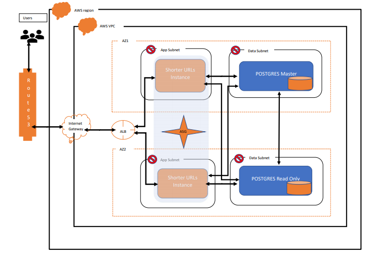

# 5848cf8a7dd2-tocryp
Requirements

* Login to EC2 instance
* RUN CMD 'sudo yum update'
* Install Python3 RUN CMD 'sudo yum install python3'
* Install pip : 
    *   curl -O https://bootstrap.pypa.io/get-pip.py
    *   python3 get-pip.py --user
* Install shorturl app related packages
    * pip install -r requirements.txt
* Run ShortUrl App : python3 app.py
* Install docker
    * sudo amazon-linux-extras install docker   
    * sudo yum install docker 
    * sudo service docker start
    * Add user in docker deamon
        * sudo groupadd docker
        * sudo usermod -aG docker ${USER}
        * logout and log in again to reflect the changes.
 * Download code from github
   * git clone https://github.com/chaudharysud/5848cf8a7dd2-tocryp.git
* Buid docker image
   *  docker build --tag shortenurl:1.0 .
* Run docker container from snapshot
   *  docker run -d -p 80:5000 shortenurl:1.0

System Design 

* To improve the performance MEMCache can be introduced between EC2 instance and database.

 
