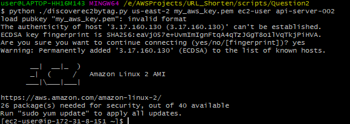
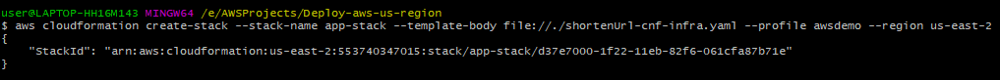
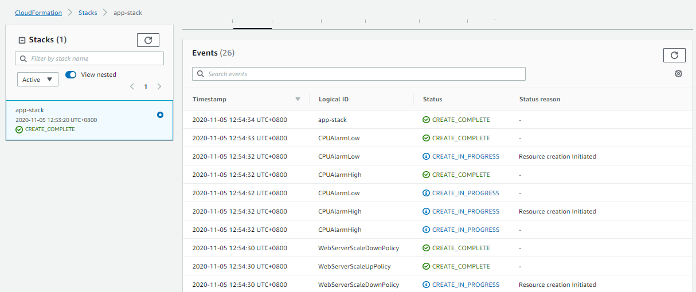
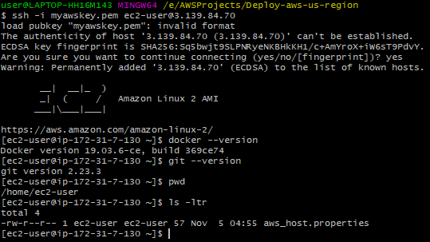
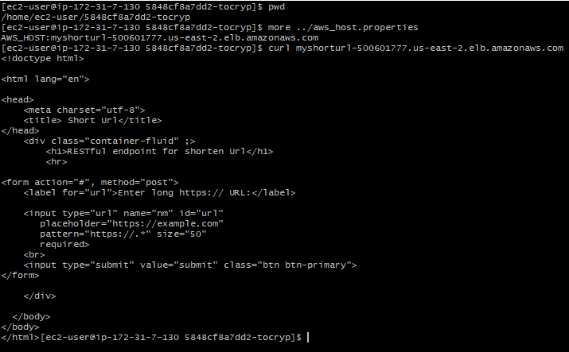
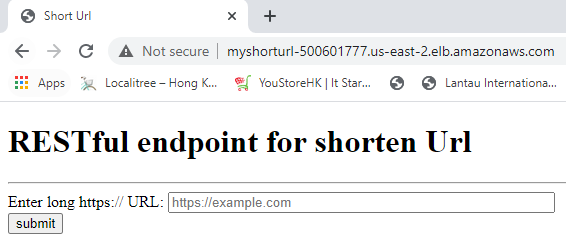
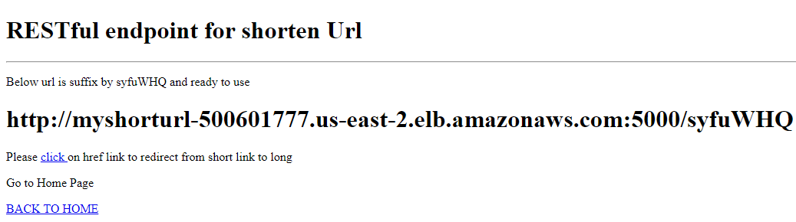
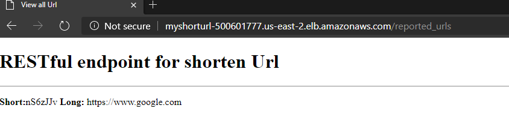

# 5848cf8a7dd2-tocryp

#Question-1: Access Log analytics
Please prepare 3 shell script(s) (any shell script executable on Linux in AWS
environment) to:
1. Count the total number of HTTP requests recorded by this access logfile
2. Find the top-10 (host) hosts makes most requests from 2019-06-10 00:00:00 to
2019-06-19 23:59:59, inclusively
3. Find out the country with most requests originating from (according to the sourceIP)
----

Answer:

Requirements:

Linux server:

If launching the Amazon EC2 instance please consider below as user data, otherwise please run with sudo

* yum install python3 -y
* yum install geoip
* curl -O https://bootstrap.pypa.io/get-pip.py
* python3 get-pip.py --user
* yum install git -y

a) Run following command to cound the HTTP request

download the code :
git clone https://github.com/chaudharysud/5848cf8a7dd2-tocryp.git

output: gitdownload


```console
git clone https://github.com/chaudharysud/5848cf8a7dd2-tocryp.git

cd ./5848cf8a7dd2-tocryp/Quesion1

#change the permission of file

chmod u+x *.sh

./counthttp.sh HTTP ./access.log

```
Output:


b) 
#Find the top-10 (host) hosts makes most requests from 2019-06-10 00:00:00 to 2019-06-19 23:59:59, inclusively

This script will create the host.txt which will conatin top 10 host, please refer the output

```console
cd ./5848cf8a7dd2-tocryp/Question1

./toptenhost.sh
```
Output:


c) Get host by country


```console
cd ./5848cf8a7dd2-tocrypQuestion1

./toptenhost.sh
```
Output:


 ```console
cd ./5848cf8a7dd2-tocryp/Question1

 ./getcountrybyhost.sh
```
 

#Question-2:AWS API programming 
Please help to prepare a script to query AWS API and look up the public IP of the instance with the specific EC2 Name tag. Then the script should execute the ssh command 
ssh ec2-user@EC2_PUBLIC_IP .
----


Requirements:
* Please install boto3 API of python3
* Please make sure pem key is at the same level as script
* Associate the Tag : api-server-002 in EC2 instance


 ```console
cd ./5848cf8a7dd2-tocryp/Question2

# run following command

#python ./discoverec2bytag.py <aws-region> <pem key> <ec2 user> <tag value>

python ./discoverec2bytag.py us-east-2 my_aws_key.pem ec2-user api-server-002

```

output:




#Question-3:System design and Implementation 
Please implement a URL shortener service (e.g. https://bitly.com/) 
Implement a simple bit.ly like service
----

Requirements
----------------

Below steps are part of cloudformation

* Login to EC2 instance
* RUN CMD 'sudo yum update'
* Install Python3 RUN CMD 'sudo yum install python3'
* Install pip : 
    *   curl -O https://bootstrap.pypa.io/get-pip.py
    *   python3 get-pip.py --user
* Install shorturl app related packages
    * pip install -r requirements.txt
* Run ShortUrl App : python3 app.py
* Install docker
    * sudo amazon-linux-extras install docker   
    * sudo yum install docker 
    * sudo service docker start
    * Add user in docker deamon
        * sudo groupadd docker
        * sudo usermod -aG docker ${USER}
        * logout and log in again to reflect the changes.
        
--------------
Steps to run shorenten url aplication:

a)  Login to the instance where aws client is configured.

b)Download code from github
   * git clone https://github.com/chaudharysud/5848cf8a7dd2-tocryp.git
   
c) Please update the {{KeyName: myawskey}} in the ./5848cf8a7dd2-tocryp/shortenUrl-cnf-infra.yaml

d) Run following command (this will take the defult VPC setup):

```consolde

$ aws cloudformation create-stack --stack-name app-stack --template-body file://./shortenUrl-cnf-infra.yaml --profile awsdemo --region us-east-2

```
Output



Output: Cloudforation execution on AWS successful:




* Login to the public Ip EC2 instance

```console
ssh -i myawskey.pem ec2-user@<ip-address>

# check following:

$ ssh -i myawskey.pem ec2-user@3.139.84.70
docker --version

git --version

```
output:




* Run git clone

```console
git clone https://github.com/chaudharysud/5848cf8a7dd2-tocryp.git

cd 5848cf8a7dd2-tocryp

chmod u+x deploy-app.sh
#run follow command to have docker as sudo permission to run the docker command

sudo usermod -aG docker ${USER}

# Please logout and login EC2 instance.

```

* Run Deploy sh file will update the ELB host in webapp
 * Do following : 
    * Buid docker image
       *  docker build --tag shortenurl:1.0 .
    * Run docker container from snapshot
       *  docker run -d -p 80:5000 shortenurl:1.0
```console

./deploy-app.sh

```

Output : Dockerimage_deployed.PNG



Output: Main Page



Output: click_onlink_to_goto_long_url



Output: After click :


Output : To display all submiited url




System Design 

* To improve the performance MEMCache can be introduced between EC2 instance and database.
* With Cloudformation implemenation currently the solution of database is based on single instance but the code is configurable to run with postgres if the database insatnce created manually.


 
